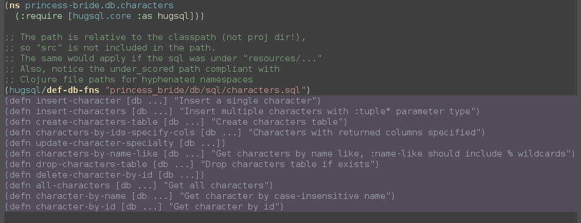

# hugsql-ghosts

Displays ghostly [hugsql](https://www.hugsql.org) defns of your queries in your cider buffers.


*(It'll look better with your color theme of course.)*

## Installation

As hugsql-ghosts is not (yet) available via elpa, you should install the following packages (preferably through elpa):

 - <a href="https://github.com/magnars/s.el">s.el</a>
 - <a href="https://github.com/magnars/dash.el">dash.el</a>
 - <a href="https://github.com/clojure-emacs/cider">cider</a>

Then put hugsql-ghosts.el in your elisp path, require it in your .emacs and add it to the cider file reload hook:

```cl
(require 'hugsql-ghosts)
(add-hook 'cider-mode-hook 'hugsql-ghosts-install-hook)
```

Ghosts should now appear in all cider buffers which have either `(hugsql/def-db-fns "path/to/your/queries.sql")` or `(hugsql/def-sqlvec-fns "path/to/your/queries.sql")`.
Please note that this only works if you've required `hugsql.core` as `hugsql` in your clojure source. Furthermore, changes in sql are only reflected after you reload your cider buffer (C-c C-k).

**Hugsql-ghosts needs an active cider connection to work as the query parsing is done by the hugsql library itself via cider.**


## Usage / Configuration

If you don't want the function doc strings to be displayed you can set `hugsql-ghosts-show-descriptions` to `nil`.
By default the doc strings will be displayed on the same line as the `defun`, if you don't like that or don't have enough horizontal screen real-estate, you can set `hugsql-ghosts-newline-before-docstrings` to `t`.

The display of ghosts can be triggered manually by calling `hugsql-ghosts-display-query-ghosts`, to get rid of them simply call `hugsql-ghosts-remove-overlays`.

Finally, you can customize the face `hugsql-ghosts-defn` to adapt the overlay appearance to your liking.


## Acknowledgement

This is an adaption of [yesql-ghosts](https://github.com/magnars/yesql-ghosts) by Magnar Sveen so most of the credit must go to him.

## License

Copyright (C) 2017 Roland Kaercher

Authors: Roland Kaercher <roland.kaercher@gmail.com> based on work by Magnar Sveen <magnars@gmail.com>

This program is free software; you can redistribute it and/or modify
it under the terms of the GNU General Public License as published by
the Free Software Foundation, either version 3 of the License, or
(at your option) any later version.

This program is distributed in the hope that it will be useful,
but WITHOUT ANY WARRANTY; without even the implied warranty of
MERCHANTABILITY or FITNESS FOR A PARTICULAR PURPOSE.  See the
GNU General Public License for more details.

You should have received a copy of the GNU General Public License
along with this program.  If not, see <http://www.gnu.org/licenses/>.